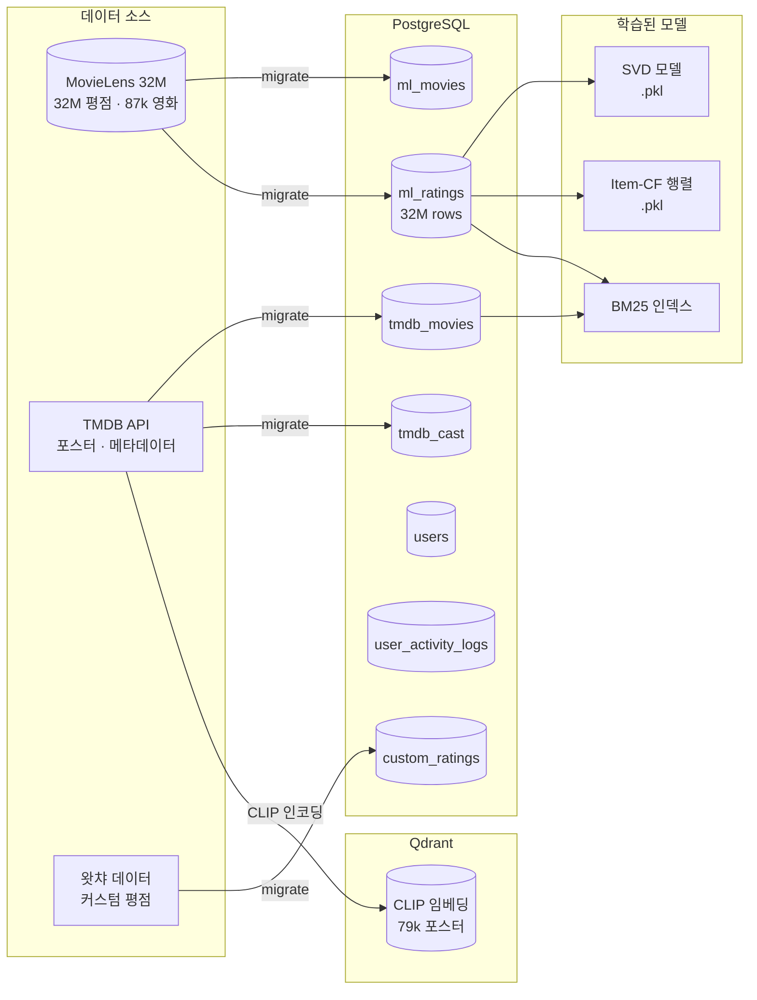
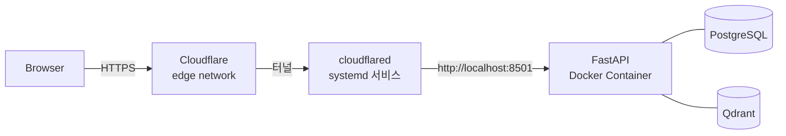

# 볼거 없나?

영화 추천 서비스를 개발하고 운영하고 있습니다.

**[mingyuprojects.dev](https://mingyuprojects.dev/)**

넷플릭스 같은 OTT를 켜도 "볼 게 없다"는 느낌, 다들 한 번쯤 겪어봤을 겁니다. 추천 모델이 있는데도 불구하고 유튜브에서 "넷플릭스 영화 추천"을 검색하게 되는 이유를 고민하다 시작한 프로젝트입니다.

## 시스템 아키텍처


---

## 추천 파이프라인


---

## 데이터 파이프라인



---

## 프로젝트 구조

```
movie_recommendation/
├── src/
│   ├── app/                        # FastAPI 웹 애플리케이션
│   │   ├── api/
│   │   │   ├── main.py             # 앱 생성 · lifespan
│   │   │   ├── routes/             # auth · movies · ratings · search …
│   │   │   └── models.py           # Pydantic 응답 모델
│   │   ├── services/               # 서비스 레이어 (데이터 액세스 · 추천 · CLIP)
│   │   └── templates/              # Jinja2 HTML 템플릿
│   │
│   ├── config/                     # 설정 파일 (중앙 관리)
│   │   ├── modeling.yaml           # SVD · Item-CF · NER · BM25 하이퍼파라미터
│   │   ├── vector_store.yaml       # Qdrant / FAISS 설정
│   │   ├── app.yaml                # 앱 UI 옵션 (장르 · 언어 목록)
│   │   └── data.yaml               # 데이터 필터링 설정 (최소 평점 수)
│   │
│   ├── assets/                     # 학습된 모델 바이너리 (중앙 관리, git 제외)
│   │   ├── svd_params.npz
│   │   └── item_based_model.pkl
│   │
│   └── core/                       # 도메인 로직 (앱에 독립적)
│       ├── modeling/
│       │   └── models/
│       │       ├── svd/            # SVD 협업 필터링
│       │       ├── item_based/     # 아이템 기반 CF
│       │       ├── clip/           # CLIP 포스터 검색
│       │       ├── query_search/   # BM25 + NER 검색
│       │       └── language/       # 언어 감지 · 번역
│       ├── vector_store/           # Qdrant 클라이언트
│       ├── user_system/            # 인증 · 활동 로그 (PostgreSQL)
│       ├── cold_start/             # 콜드 스타트 (인기 영화 랜덤)
│       └── research/               # 오프라인 연구 도구
│           ├── ab_testing/
│           ├── dataset_generation/
│           └── llm/                # Qwen LLM 래퍼
│
├── tests/
│   ├── conftest.py
│   ├── test_user_system.py
│   ├── test_api.py
│   ├── test_data_loader.py
│   └── test_vector_search.py
│
├── compose.yaml                    # Docker Compose (app · postgres · qdrant)
├── Dockerfile
└── pyproject.toml
```

---

## 배포

서버에서 **Docker Compose + Cloudflare Tunnel** 조합으로 운영합니다.



### 서버에서 실행

```bash
# 이미지 빌드 후 백그라운드 실행
docker compose up -d --build

# 로그 확인
docker compose logs -f app

# 재시작
docker compose restart app
```

### Cloudflare Tunnel 설정

터널은 systemd 서비스로 관리됩니다.

```bash
# 상태 확인
systemctl status cloudflared

# 재시작 (config 변경 후)
sudo systemctl restart cloudflared

# config 위치
cat /etc/cloudflared/config.yml
```

`/etc/cloudflared/config.yml` 구조:

```yaml
tunnel: <TUNNEL_ID>
credentials-file: /home/server/.cloudflared/<TUNNEL_ID>.json

ingress:
  - hostname: ssh.mingyuprojects.dev
    service: ssh://localhost:22
  - hostname: mingyuprojects.dev
    service: http://localhost:8501   # FastAPI 앱
  - service: http_status:404
```

---

## 로컬 개발

이 프로젝트는 [uv](https://docs.astral.sh/uv/)로 의존성을 관리합니다.

```bash
# uv 설치
curl -LsSf https://astral.sh/uv/install.sh | sh

# 의존성 설치
uv sync

# 환경변수 설정
cp .env.example .env

# 개발 서버 실행 (PostgreSQL · Qdrant는 Docker로)
docker compose up -d postgres qdrant
PYTHONPATH=src:src/app uv run uvicorn app.api.main:app --reload --port 8501
```

### 테스트

```bash
# 빠른 테스트 (DB 연결 필요)
uv run pytest tests/test_user_system.py tests/test_api.py -v

# 전체 (데이터 로드 포함, 느림)
uv run pytest -v -m "not slow"
uv run pytest -v  # slow 포함
```

### 플랫폼별 PyTorch

| 플랫폼 | torch 소스 | 비고 |
|--------|-----------|------|
| Linux  | `download.pytorch.org/whl/cpu` | CPU 전용 |
| macOS  | PyPI | MPS(Apple Silicon) 지원 |

---

## 데이터셋

| 테이블 | 출처 | 행 수 |
|--------|------|-------|
| `ml_movies` | MovieLens 32M | 87,585 |
| `ml_ratings` | MovieLens 32M | 32,000,204 |
| `ml_links` | MovieLens 32M | 87,585 |
| `ml_tags` | MovieLens 32M | 2,000,055 |
| `tmdb_movies` | TMDB API | 79,093 |
| `tmdb_cast` | TMDB API | 1,707,013 |
| `custom_ratings` | 왓챠 / 사용자 | 11,639,311 |
| `movie_comments` | 왓챠 | 1,318,238 |

---

## 개발 기록

- **개발 일지**: [`docs/JOURNAL.md`](docs/JOURNAL.md)
- **의사결정 기록**: [`docs/decisions/`](docs/decisions/)
