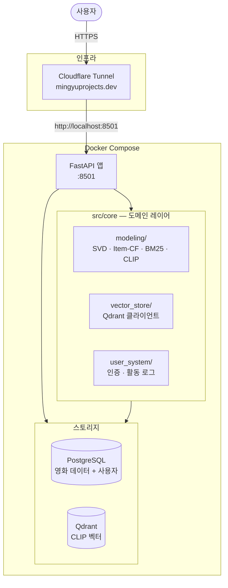
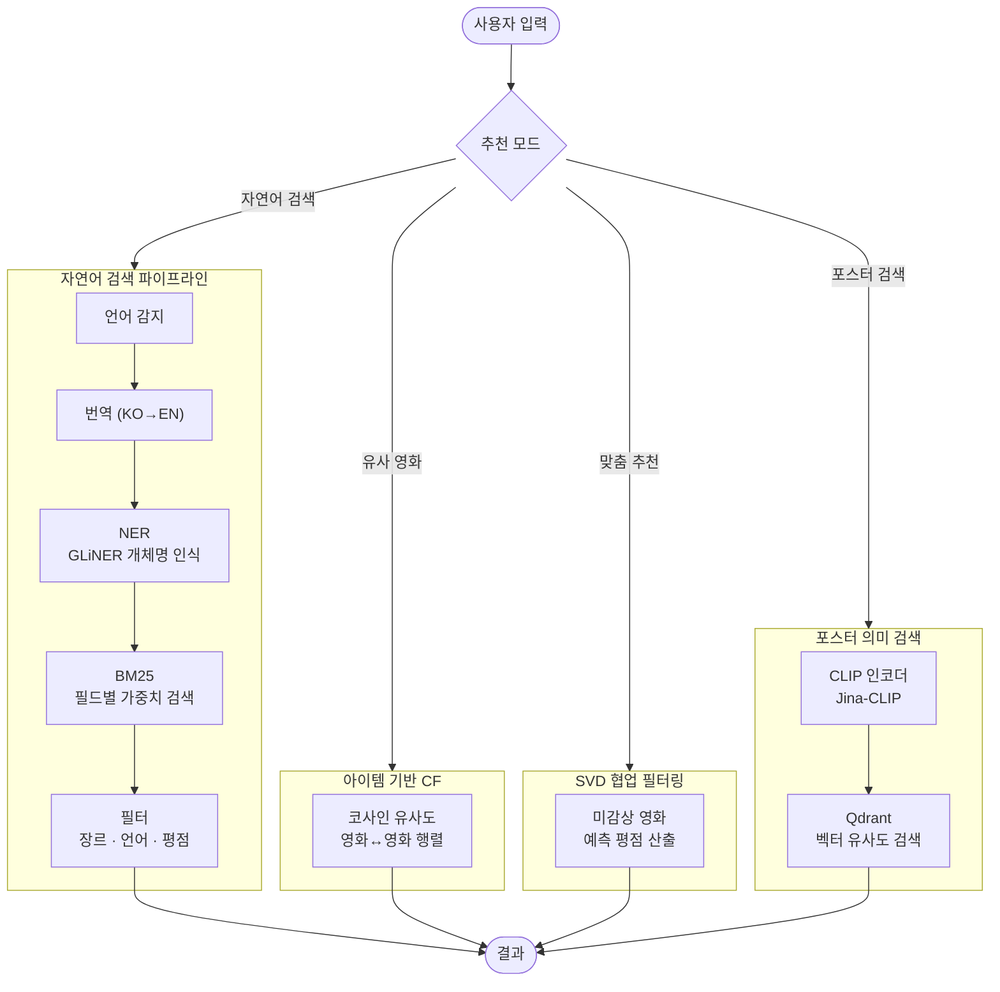
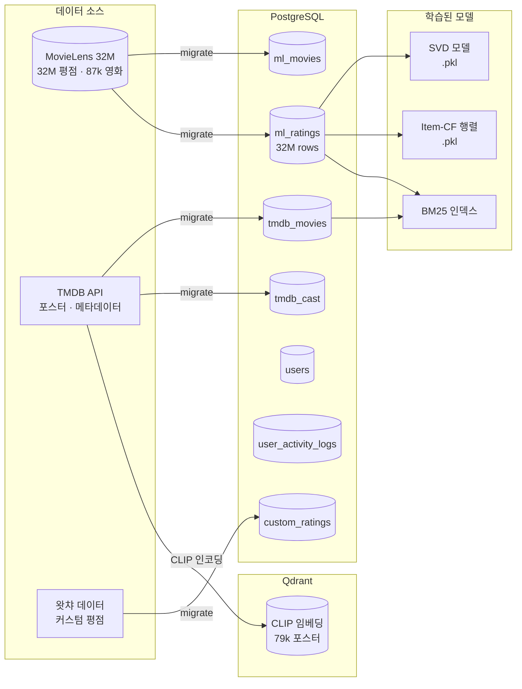
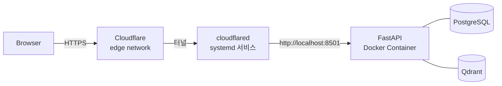

# 볼거 없나?

영화 추천 서비스를 개발하고 운영하고 있습니다.

**[mingyuprojects.dev](https://mingyuprojects.dev/)**

넷플릭스 같은 OTT를 켜도 "볼 게 없다"는 느낌, 다들 한 번쯤 겪어봤을 겁니다. 추천 모델이 있는데도 불구하고 유튜브에서 "넷플릭스 영화 추천"을 검색하게 되는 이유를 고민하다 시작한 프로젝트입니다.

## 시스템 아키텍처



---

## 추천 파이프라인



---

## 데이터 파이프라인



---

## 프로젝트 구조

```
movie_recommendation/
├── src/
│   ├── app/                            # FastAPI 웹 애플리케이션 레이어
│   │   ├── api/
│   │   │   ├── main.py                 # FastAPI 앱 팩토리 · 라우터 등록
│   │   │   ├── lifespan.py             # 시작/종료 시 모델 워밍업
│   │   │   ├── app_state.py            # 로딩 상태 공유 (워밍업 진행률)
│   │   │   ├── schemas.py              # Pydantic 요청/응답 모델
│   │   │   ├── utils.py                # from_dataframe · log_search_activity 등
│   │   │   └── routes/
│   │   │       ├── home.py             # SSR 메인 페이지 (Jinja2)
│   │   │       ├── search.py           # GET /search/natural-language
│   │   │       ├── poster_search.py    # GET /search/poster
│   │   │       ├── movies.py           # GET /movies/{id}
│   │   │       ├── ratings.py          # POST/DELETE /ratings
│   │   │       ├── auth.py             # POST /auth/login · /logout
│   │   │       ├── users.py            # GET /users/{id}
│   │   │       ├── activity.py         # POST /activity/click
│   │   │       └── health.py           # GET /health
│   │   ├── services/                   # 라우트가 직접 호출하는 서비스 레이어
│   │   │   ├── data_access.py          # 영화 검색 · 통계 · cast 로드 (lru_cache)
│   │   │   ├── recommender_service.py  # UserCF · ItemCF 파이프라인 싱글턴
│   │   │   └── clip_service.py         # PosterSearch 파이프라인 싱글턴
│   │   └── templates/                  # Jinja2 HTML 템플릿
│   │
│   ├── config/                         # 설정 파일 (중앙 관리)
│   │   ├── modeling.yaml               # SVD · Item-CF · NER · BM25 하이퍼파라미터
│   │   ├── vector_store.yaml           # Qdrant / FAISS 설정
│   │   ├── app.yaml                    # UI 옵션 (장르 · 언어 목록)
│   │   └── data.yaml                   # 데이터 필터링 설정 (최소 평점 수)
│   │
│   ├── assets/                         # 학습된 모델 바이너리 (git 제외)
│   │   ├── svd_params.npz
│   │   └── item_based_model.pkl
│   │
│   └── core/                           # 도메인 로직 (앱 레이어에 독립적)
│       │
│       ├── pipelines/                  # 추천/검색 파이프라인 (서비스 레이어에서 호출)
│       │   ├── user_cf.py              # SVD 기반 사용자 맞춤 추천
│       │   ├── item_cf.py              # 코사인 유사도 기반 유사 영화 추천
│       │   ├── natural_language.py     # BM25 + NER 자연어 검색
│       │   └── poster_search.py        # CLIP 벡터 포스터 의미 검색
│       │
│       ├── modeling/
│       │   ├── models/
│       │   │   ├── svd/                # Surprise SVD 모델 · 데이터로더
│       │   │   ├── item_based/         # 코사인 유사도 행렬 모델 · 데이터로더
│       │   │   ├── clip/               # CLIP 인코더 (OpenAI · SigLIP · Jina · OpenCLIP)
│       │   │   ├── query_search/       # BM25 + NER 검색 엔진
│       │   │   │   ├── lexical_search/ # BM25 핵심 로직 · 토크나이저 · 설정
│       │   │   │   └── ner/            # GLiNER · Qwen 기반 개체명 인식
│       │   │   ├── language/           # 언어 감지 · 번역 (KO→EN)
│       │   │   └── recommender/        # 추천 결과 포맷터
│       │   └── utils/
│       │       ├── cast.py             # build_cast_info() — 배우/감독 정보 변환
│       │       ├── filters.py          # apply_movie_filters() — 공통 필터 유틸
│       │       ├── data.py             # filter_by_min_counts 등 전처리 유틸
│       │       ├── train.py            # Surprise 학습 유틸 · train/test 분할
│       │       └── ...
│       │
│       ├── db/
│       │   ├── loader.py               # load_ml_ratings() — Parquet 캐시 포함
│       │   └── data_access.py          # load_movie_data() · load_cast_data() 등
│       │
│       ├── vector_store/               # 벡터 스토어 클라이언트
│       │   ├── qdrant_manager.py       # Qdrant 검색 · 인덱스 관리
│       │   ├── faiss_manager.py        # FAISS (레거시)
│       │   ├── build_index.py          # CLIP 임베딩 → Qdrant 적재
│       │   └── rebuild_qdrant_index.py # 인덱스 재구축 스크립트
│       │
│       ├── user_system/
│       │   └── db_manager.py           # 회원가입 · 로그인 · 평점 · 활동 로그 (PostgreSQL)
│       │
│       ├── cold_start/
│       │   └── show_random_movies.py   # 미평점 사용자용 인기 영화 랜덤 추출
│       │
│       ├── data_scraping/              # 데이터 수집 스크립트 (TMDB · OMDB · ML)
│       │
│       └── research/                   # 오프라인 연구 도구 (서비스와 분리)
│           ├── ab_testing/             # A/B 테스트 평가기
│           ├── dataset_generation/     # 쿼리 데이터셋 생성
│           └── llm/                    # Qwen LLM 래퍼
│
├── notebooks/                          # 탐색적 분석 · 모델 실험 노트북
├── tests/
│   ├── test_user_system.py
│   ├── test_api.py
│   ├── test_data_loader.py
│   └── test_vector_search.py
│
├── compose.yaml                        # Docker Compose (app · postgres · qdrant)
├── Dockerfile
└── pyproject.toml
```

---

## 코드 계층 구조

코드는 **3개 계층**으로 나뉘며, 위에서 아래 방향으로만 의존합니다.

```
app/api/routes/      ← HTTP 요청 처리, 템플릿 렌더링
       ↓
app/services/        ← 파이프라인 싱글턴 관리, 데이터 조회 캐싱
       ↓
core/pipelines/      ← 추천/검색 오케스트레이션 (모델 + DB 조합)
       ↓
core/modeling/       ← ML 모델 (SVD · Item-CF · BM25 · CLIP)
core/db/             ← DB 쿼리 · Parquet 캐시
core/vector_store/   ← Qdrant 벡터 검색
```

### 주요 모듈 역할

| 모듈 | 역할 |
|------|------|
| `app/api/routes/home.py` | SSR 메인 페이지. 28개 쿼리 파라미터를 받아 페이지별 핸들러(`_handle_*`)에 위임하고 Jinja2로 렌더링 |
| `app/api/routes/search.py` | BM25 검색 REST API (`/search/natural-language`) |
| `app/api/routes/poster_search.py` | CLIP 포스터 검색 REST API (`/search/poster`) |
| `app/api/schemas.py` | 모든 Pydantic 요청/응답 모델 정의 |
| `app/api/utils.py` | `from_dataframe()` (DataFrame → dict 변환), `log_search_activity()`, `get_current_user_from_cookies()` |
| `app/services/data_access.py` | `load_movie_data()`, `load_cast_data()`, `search_movies_cached()` 등 — `lru_cache`로 반복 호출 최적화 |
| `app/services/recommender_service.py` | `get_user_cf_pipeline()`, `get_item_cf_pipeline()` 싱글턴 |
| `app/services/clip_service.py` | `get_poster_search_pipeline()` 싱글턴 |
| `core/pipelines/user_cf.py` | SVD 모델 로딩 + 미감상 영화 예측 평점 산출 |
| `core/pipelines/item_cf.py` | 코사인 유사도 행렬 로딩 + 유사 영화 검색 + 필터 적용 |
| `core/pipelines/natural_language.py` | 언어 감지 → 번역 → NER → BM25 검색 → 필터 전 과정 오케스트레이션 |
| `core/pipelines/poster_search.py` | 텍스트 쿼리 → CLIP 인코딩 → Qdrant 벡터 검색 → 메타데이터 결합 |
| `core/modeling/models/svd/` | Surprise SVD 학습 · 저장(`save()`) · 로드(`load()`) |
| `core/modeling/models/item_based/` | 코사인 유사도 행렬 학습 · 저장(`save()`) · 로드(`load()`) |
| `core/modeling/models/clip/` | CLIP 인코더 추상 계층. `BaseClipEncoder`를 상속한 OpenAI · SigLIP · Jina · OpenCLIP 구현체 |
| `core/modeling/models/query_search/` | BM25 인덱스 + GLiNER/Qwen NER 파이프라인 |
| `core/modeling/utils/cast.py` | `build_cast_info()` — 배우/감독/작가 DataFrame → `MovieCastInfo` Pydantic 변환 |
| `core/modeling/utils/filters.py` | `apply_movie_filters()` — 장르·언어·연도·평점 필터 공통 구현 |
| `core/db/loader.py` | `load_ml_ratings()` — 32M 평점 데이터 로드 (Parquet 캐시 우선) |
| `core/db/data_access.py` | `load_movie_data()` — 영화 메타데이터 로드 (PostgreSQL) |
| `core/vector_store/qdrant_manager.py` | Qdrant 컬렉션 생성 · 벡터 검색 · 필터 검색 |
| `core/user_system/db_manager.py` | 회원가입 · 로그인 인증 · 평점 저장/조회 · 클릭 로그 기록 |
| `core/research/` | 서비스와 분리된 오프라인 도구. A/B 테스트 평가, LLM 기반 쿼리 생성 등 |

---

## 배포

서버에서 **Docker Compose + Cloudflare Tunnel** 조합으로 운영합니다.



### 서버에서 실행

```bash
# 이미지 빌드 후 백그라운드 실행
docker compose up -d --build

# 로그 확인
docker compose logs -f app

# 재시작
docker compose restart app
```

### 자동 배포 (CD)

`main` 브랜치에 새 커밋이 push되면 서버가 5분 안에 자동으로 감지하고 배포합니다.

```
main에 push
    └─▶ movie-deploy.timer (5분 간격)
            └─▶ deploy-if-updated.sh
                    ├─ git fetch → 변경 없으면 종료
                    ├─ git pull
                    ├─ docker compose up -d --build
                    └─ Slack 알림 (시작 / 완료 / 실패)
```

**구성 파일**

| 파일 | 역할 |
|------|------|
| `~/deploy-if-updated.sh` | 변경 감지 · 배포 · Slack 알림 스크립트 |
| `/etc/systemd/system/movie-deploy.service` | 스크립트를 실행하는 oneshot 서비스 |
| `/etc/systemd/system/movie-deploy.timer` | 5분마다 서비스를 트리거하는 타이머 |

**타이머 관리**

```bash
# 상태 확인
systemctl status movie-deploy.timer

# 다음 실행 시각 확인
systemctl list-timers movie-deploy.timer

# 즉시 수동 실행
sudo systemctl start movie-deploy.service

# 로그 확인
journalctl -u movie-deploy.service -n 20
```

---

### Cloudflare Tunnel 설정

터널은 systemd 서비스로 관리됩니다.

```bash
# 상태 확인
systemctl status cloudflared

# 재시작 (config 변경 후)
sudo systemctl restart cloudflared

# config 위치
cat /etc/cloudflared/config.yml
```

`/etc/cloudflared/config.yml` 구조:

```yaml
tunnel: <TUNNEL_ID>
credentials-file: /home/server/.cloudflared/<TUNNEL_ID>.json

ingress:
  - hostname: ssh.mingyuprojects.dev
    service: ssh://localhost:22
  - hostname: mingyuprojects.dev
    service: http://localhost:8501   # FastAPI 앱
  - service: http_status:404
```

---

## 로컬 개발

이 프로젝트는 [uv](https://docs.astral.sh/uv/)로 의존성을 관리합니다.

```bash
# uv 설치
curl -LsSf https://astral.sh/uv/install.sh | sh

# 의존성 설치
uv sync

# 환경변수 설정
cp .env.example .env

# 개발 서버 실행 (PostgreSQL · Qdrant는 Docker로)
docker compose up -d postgres qdrant
PYTHONPATH=src:src/app uv run uvicorn app.api.main:app --reload --port 8501
```

### 테스트

```bash
# 빠른 테스트 (DB 연결 필요)
uv run pytest tests/test_user_system.py tests/test_api.py -v

# 전체 (데이터 로드 포함, 느림)
uv run pytest -v -m "not slow"
uv run pytest -v  # slow 포함
```

### 플랫폼별 PyTorch

| 플랫폼 | torch 소스 | 비고 |
|--------|-----------|------|
| Linux  | `download.pytorch.org/whl/cpu` | CPU 전용 |
| macOS  | PyPI | MPS(Apple Silicon) 지원 |

---

## 데이터셋

| 테이블 | 출처 | 행 수 |
|--------|------|-------|
| `ml_movies` | MovieLens 32M | 87,585 |
| `ml_ratings` | MovieLens 32M | 32,000,204 |
| `ml_links` | MovieLens 32M | 87,585 |
| `ml_tags` | MovieLens 32M | 2,000,055 |
| `tmdb_movies` | TMDB API | 79,093 |
| `tmdb_cast` | TMDB API | 1,707,013 |
| `custom_ratings` | 왓챠 / 사용자 | 11,639,311 |
| `movie_comments` | 왓챠 | 1,318,238 |

---

## 개발 기록

- **개발 일지**: [`docs/JOURNAL.md`](docs/JOURNAL.md)
- **의사결정 기록**: [`docs/decisions/`](docs/decisions/)
