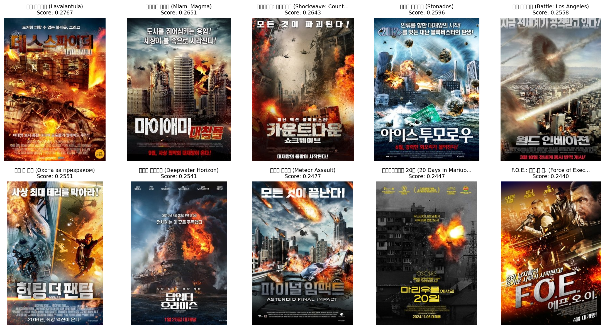
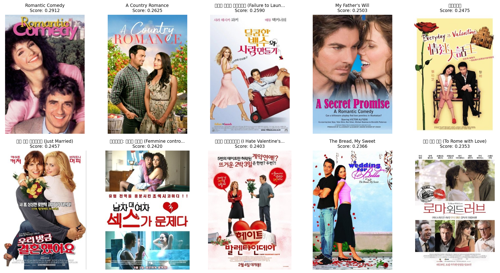
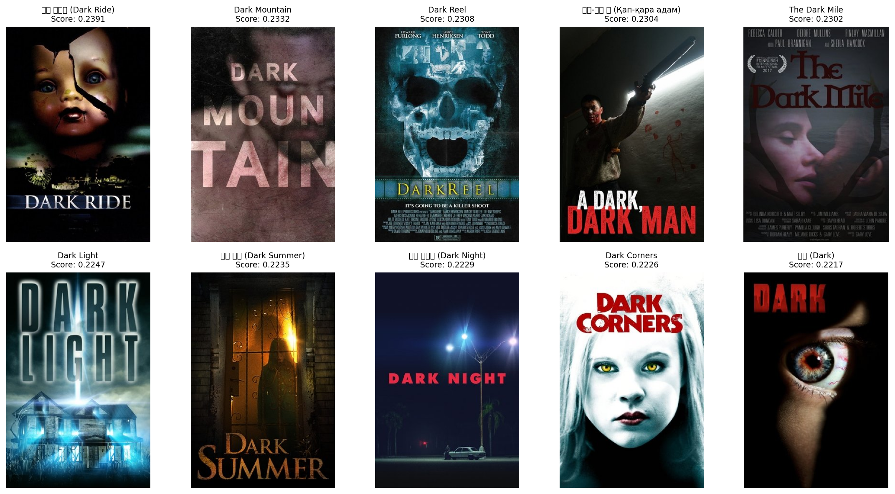

# Project Journal

> 영화 추천 시스템 개발 일지

## 작성 가이드
- 날짜별로 역순 정리 (최신이 위로)
- 각 항목: 작업 내용, 결과, 배운 점, 다음 할 일
- 주요 의사결정은 `decisions/` 폴더에 별도 문서로 작성


---


## 2025-11-20 (목)

### [🔍 실험/테스트] 유저 클러스터링 실험 시작

- **작업 배경**
  - Cold User 문제 해결 및 추천 다양성 확보
  - 비슷한 성향의 유저들을 묶어서 추천해주는 방식(User Clustering) 도입 시도

- **작업 내용**
  - 유저 클러스터링 구현을 위한 사전 조사 및 기획
  - 어떤 Feature를 사용할지 고민 (평점 패턴, 선호 장르 등)
  - [유저 클러스터링 분석 노트북](../../movie_recommendation/modeling/notebooks/clustering.ipynb)

- **고민하는 내용**
  - 어떤 피처 사용해야하지? 지금 구현한 노트북에는 장르별 평균 평점을 사용함.
    - 보지 않은 장르에 대해서는 어떻게 채워야하지? 
      - 전체 평균
      - 유저의 평균
      - 0 
    - 나는 0으로 채워야한다고 생각. 관심없다는 걸 명확히 표현하기 위해서.
  - 클러스터링이 잘되었다고는 어떻게 판단하지?
    - 군집끼리 차이가 분명한지 (프로파일 기반)
    - Silhouette Score가 높은지
  - 프로파일을 어떻게 생성하지?
    - 평균평점이 높은 장르를 통해 텍스트 생성?


---

## 2025-11-18 (월)

### [🔍 실험/테스트] Vector Store 검색 기능 테스트

- **작업 배경**
  - CLIP 기반 벡터 스토어 구축 후 실제 검색 성능 확인 필요
  - 텍스트 쿼리로 영화 포스터 검색이 제대로 동작하는지 검증 필요
  - 검색 결과 시각화를 통해 직관적으로 결과 확인

- **작업 내용**
  - Vector Store 검색 테스트 스크립트 개발
    - [`vector_store/test_search.py`](../../vector_store/test_search.py)
  - FAISS 인덱스 로드 및 검색 기능 테스트
  - CLIP 인코더를 활용한 텍스트 쿼리 검색 테스트
  - 검색 결과 포스터 시각화 기능 구현
  - 다양한 장르별 검색 쿼리 테스트
    - "action movie with explosions" (액션 영화)
    - "romantic comedy" (로맨틱 코미디)
    - "dark thriller" (다크 스릴러)

- **테스트 결과**
  - 검색 기능 정상 동작 확인
  - 각 쿼리별로 관련성 높은 영화 포스터 검색 성공
  - 검색 결과 시각화 이미지 생성 완료:
    - query: action_movie_with_explosions
      
    - query: romantic_comedy
      
    - query: dark_thriller
      
  - 생각보다 성능이 되게 괜찮다!!!

- **배운 점**
  - CLIP 모델이 텍스트 쿼리를 벡터로 인코딩하여 이미지 검색이 가능함을 확인
  - FAISS 인덱스를 통한 빠른 유사도 검색 성능 확인
  - 검색 결과 시각화가 모델 성능 평가에 매우 유용함
  - 영어 쿼리 기준으로 검색 품질이 양호함

### [⚡ 성능 개선] Vector Store 생성 속도 최적화

- **작업 배경**
  - 기존 벡터 스토어 생성이 순차 처리로 인해 매우 느림 (80,000개 영화 처리 시 약 13시간 소요)
  - 이미지 다운로드 대기 시간 동안 CPU/GPU 유휴 상태
  - CLIP 모델을 1개씩 처리하여 GPU 활용도 낮음

- **작업 내용**
  - **멀티스레딩 이미지 다운로드** 구현
    - `ThreadPoolExecutor`로 최대 20개 동시 다운로드
    - I/O bound 작업 병렬화로 대기 시간 최소화
  - **GPU 배치 인코딩** 구현
    - 32개 이미지를 한 번에 배치 처리
    - GPU 병렬 연산 활용으로 처리량 극대화
  - **재시도 로직** 추가
    - 네트워크 오류 시 최대 3회 자동 재시도
    - 안정성 및 성공률 향상
  - **메모리 효율적 청크 처리**
    - 100개씩 배치 단위로 처리
    - 대용량 데이터셋도 안정적 처리 가능

- **성능 개선 결과**
  - **처리 속도**: 5-10배 향상
    - 이전: ~50-100 영화/분
    - 개선 후: ~500-1000 영화/분 (GPU 기준)
  - **80,000개 영화 처리 시간**
    - 이전: ~800분 (약 13시간)
    - 개선 후: ~80-160분 (약 1.5-2.5시간)
    - **절감 시간**: 약 10-12시간

- **설정 가능한 파라미터** (`config.yaml`)
  ```yaml
  build:
    download_batch_size: 100   # 동시 다운로드할 이미지 수
    encoding_batch_size: 32    # GPU 배치 인코딩 크기
    max_workers: 20            # 다운로드 스레드 수
    max_retries: 3             # 다운로드 재시도 횟수
  ```

- **환경별 권장 설정**
  - 고성능 GPU (A100, V100): batch_size 64, workers 30
  - 중급 GPU (RTX 3090, 4090): batch_size 32, workers 20 (기본값)
  - 저사양 GPU (GTX 1080): batch_size 16, workers 10
  - CPU 전용: batch_size 8, workers 10

- **백그라운드 실행 방법**
  ```bash
  # nohup으로 백그라운드 실행
  nohup python -m vector_store.create_vector_store > vector_store.log 2>&1 &
  
  # 로그 실시간 확인
  tail -f vector_store.log
  ```

- **기술 상세**
  - 멀티스레딩: `concurrent.futures.ThreadPoolExecutor` 사용
  - 배치 처리: PyTorch 텐서 배치 연산 활용
  - 메모리 관리: 청크 단위 처리 후 즉시 해제
  - 진행률 표시: `tqdm`으로 실시간 모니터링

- **관련 파일**
  - `vector_store/create_vector_store.py`: 메인 로직 구현
  - `vector_store/config.yaml`: 설정 파일
  - `vector_store/PERFORMANCE_IMPROVEMENTS.md`: 상세 개선 문서
  - `vector_store/README.md`: 사용 가이드 업데이트

- **배운 점**
  - I/O bound 작업(다운로드)과 CPU/GPU bound 작업(인코딩)을 분리하여 최적화
  - 배치 처리로 GPU 활용도를 크게 높일 수 있음
  - 적절한 배치 크기 선택이 메모리와 성능의 균형점
  - 멀티스레딩으로 네트워크 I/O 병목 해결 가능

---

## 2025-11-14 (금)

### [🔍 실험/테스트] 쿼리-포스터 검색 기능 테스트

- [관련해서 블로그에 정리한 글](https://mkk4726.github.io/posts/Data%20Science/Movie-Recommendation/25-11-14-CLIP-%EA%B8%B0%EB%B0%98-%EC%98%81%ED%99%94%ED%8F%AC%EC%8A%A4%ED%84%B0-%EA%B2%80%EC%83%89/)

- **작업 배경**
  - 텍스트로 이미지를 검색하는 서비스 중에 미리 캔버스 같은 경우 프레젠테이션을 추천하고 있음
  - 영화처럼 태그나 메타 데이터에 기반해 추천하는 걸로 보이지만, 이미지와 직접적으로 유사도를 계산할 수 있으면 좋지 않을까? 라는 생각

- **작업 내용**
  - clip 사용하는 모델 (인코더) 개발
    - [clip 인코더 개발 노트북](../modeling/notebooks/clip.ipynb)
  - clip 모델끼리 비교

- **이슈 및 해결내용**
  - 포스터 이미지가 세로, 인코더는 224x224 와 같이 정사각형으로 만듬 -> 이를 보완하기 위해 패딩 추가
  - 모델 결과가 아쉬움
    - 텍스트 간에 유사도 차이가 생각보다 크지 않음
    - 비슷해야하는 텍스트와 아닌 텍스트의 유사도 결과가 비슷함
  - "영어"로 입력하면 성능이 훨씬 좋음
    - 남자 포스터에 여자를 넣었을 때 음수가 나오기 시작

- **모델 실험 결과**
  - 자세한 비교 결과는 [`docs/experiments/25-11-14-clip test.md`](./experiments/25-11-14-clip-test.md) 참고.
  - "영어" 기준 JinaCLip이 쓸만하다.


### [✨ 기능 개발] 언어 탐지 및 언어 번역 기능 개발
- **작업 배경**
  - CLIP model이 기본적으로 "영어" 데이터로 학습되었다보니, 성능 차이가 심함
  - 이를 위해 포스터 검색 파이프라인 앞에 붙일 "언어 탐지" 와 "언어 번역" 기능 필요

- **작업 내용**
  - 언어 탐지 및 번역 기능 개발
    - [modeling/models/language](../../modeling/models/language)


### [✨ 기능 개발] vDB 개발
- **작업 배경**
  - 자연어-포스터 검색을 위해 벡터 스토어가 필요한 상황

- **작업 내용**
  - faiss 기반 벡터 DB(vDB) 구축
    - [vector_store/](../../vector_store/) 디렉토리 내 모듈 구현
    - 상세 설계 및 결정 사항: [docs/decisions/005-vector-database.md](../decisions/005-vector-database.md)

---

## 2025-11-12 (수)

### [🔍 실험/테스트] 검색 데이터셋 구축 실험 진행

- **작업 배경**
  - 검색 기능을 고도화하고 있는데, 어떤게 좋은지 판단하기 위해서는 데이터셋이 필요하기 때문에

- **작업 내용**
  - 영화 메타 데이터에 기반해 질문을 생성하는 기능 개발
    - [`dataset_generation/config.yaml`](../dataset_generation/config.yaml)에서 프롬프트 확인가능
  - 기본적인 컨셉은 [줄거리 기반, 배우 기반, 감독 기반, 분위기/테마 기반] 으로 질문을 생성하도록 구현
  - 영화당 4개, 영화가 약 8만개정도니까 32만개정도 생성을 목표로 진행.

- **배운 점**
  - LLM으로 데이터셋 생성하는 경험.
    - 부족한 혹은 없는 데이터를 LLM으로 보완하려는 시도가 많이 보이는데 (Toss 기술블로그 등), 실제로 해보니까 나쁘지 않네.

- **해결 못한 이슈 - 메타 데이터의 한계**
  - 문제: 메타 데이터가 풍부하지 않다보니, 생성되는 쿼리가 제한적이다.
  - 시도할 방향: 리뷰 데이터를 긁어와서, 이걸 바탕으로 태그 데이터 등을 추가로 만들 필요가 있겠다.

- **다음 할 일**
  - [ ] 생성된 질문들 분석해보기, 데이터셋으로 사용가능할지
  - [ ] 리뷰 데이터 긁어오기 -> 태그 데이터 만들어 보기

---

## 2025-11-11 (화)

### [✨ 기능 개발] NER 모델 개발 및 검색 기능 고도화
- **작업 배경**
  - 검색 쿼리에서 배우/감독 이름을 추출해서 더 정확한 검색 결과를 제공하고 싶었음
  - 검색 결과에 캐스팅 정보를 보여주면 사용자 경험이 더 좋을 것 같아서

- **작업 내용**
  - NER(Named Entity Recognition) 모델 개발
    - 쿼리에서 사람 이름(배우, 감독) 추출 기능 구현
  - 검색 결과에 cast 정보 표시 추가
  - casting 정보 데이터 추출 노트북 추가
  - 프롬프트 최적화 작업 (GPU에서 성능 확인)
  - LLM 활용 데이터셋 생성 모듈 개발
  - 검색 기능 반환 개수 5개 → 10개로 확대

- **배운 점**
  - NER을 활용한 쿼리 이해 개선 방법
  - 프롬프트 엔지니어링의 중요성 (GPU 환경에서 테스트 필요)

- **다음 할 일**
  - [ ] NER 정확도 평가
  - [ ] 배우/감독 필터링 로직 고도화


### [✨ 기능 개발] BM25기반 검색 파이프라인 개발
- **작업 배경**
  - 내 서비스를 사용하는 유저는 cold user이기 때문에, 가볍게 검색을 통해 영화를 추천 받을 수 있게 하기 위해서
  - 검색 기능 자체를 구현해보고 싶었음

- **작업 내용**
  - BM25 알고리즘 구현
  - BM25 기반 검색 파이프라인 개발 완료
    - [`modeling/models/query_search`](../modeling/models/query_search/) 에서 확인 가능
  - 검색 페이지 구현 완료

- **해결 못한 이슈 - 평가 데이터셋의 필요성**
  - BM25 가중치 튜닝, NER과 비교 등을 위해서는 데이터셋이 꼭 필요하겠다.
    - BM25의 필드별 가중치는 어떻게 구성해야하는지?
    - NER로 키워드 뽑아서 필터링하면 안되는건가?
  - 전처리 방법들
    - 아직은 단순히 " " 기준으로 짤라서 쓰고 있는데, 고도화가 많이 필요함
  - 배우, 감독 정보는 어떻게 넣고 BM25 계산해야하는거지??
    - 단순히 띄어쓰기로? 김민규 (Minku Kim, 배우) 이동영 (Dongyoung Lee, 감독) 이렇게?
  - 영어 쿼리에 대한 처리는 어떻게 해야하지? 일단은 무시할까?

- **배운 점**
  - Toss 기술 블로그에 "BM25 가중치 튜닝" 이라는 키워드가 있었는데, 이게 어떤 개념인지 알게 됨
    - 영화 필드 (제목, 출연진, 개요 등)에 적절한 가중치를 부여해야 검색 성능을 높일 수 있겠구나
  - 전체 파이프라인에 대한 감을 조금씩 잡아가고 있다. 그 중에서 BM25가 어떤 역할을 하는지도.
  
- **다음 할 일**
  - [ ] 평가 데이터셋 구축
  - [ ] 전처리 방법 고도화

---

## 2025-11-10 (월)

### [✨ 기능 개발] 검색 탭 추가 및 API 셋업
- **작업 배경**
  - 사용자가 자연어로 영화를 검색할 수 있는 기능이 필요했음
  - Cold user를 위한 진입점 마련

- **작업 내용**
  - 검색 탭 UI 추가
  - 검색 관련 API 엔드포인트 셋팅 완료
  - 기본 검색 인프라 구축

- **다음 할 일**
  - [ ] BM25 알고리즘 구현
  - [ ] 검색 파이프라인 개발

---

## 2025-11-07 (금)

### [📱 UI/UX] 모바일 환경 UI 개선 및 로그인 기능 수정
- **작업 배경**
  - 모바일에서 사용성이 떨어진다는 피드백
    - 확인하지 않았던 부분, 놓치고 있었다.
  - 반응형 디자인 필요성 인식

- **작업 내용**
  - 로그인 기능 수정 완료
  - 모바일 환경 감지 로직 구현 및 버그 수정
    - 모바일 인지 문제로 UI가 깨지는 이슈 해결
  - 모바일 환경에서 UI 개선 작업 완료
    - 터치 인터페이스 최적화
    - 화면 크기에 맞는 레이아웃 조정

- **배운 점**
  - 모바일 환경 감지의 중요성
  - 반응형 디자인 구현 시 고려사항

---

## 2025-11-06 (목)

### [🔄 리팩토링] Streamlit → FastAPI 전환 및 데이터 로더 개발
- **작업 배경**
  - Streamlit의 속도가 만족스럽지 않음
    - 불필요한 로딩이 발생하고, 이로 인해 사용하는데 불편함을 느낌
  - 더 나은 성능과 확장성을 위해 FastAPI로 전환 결정

- **작업 내용**
  - **Streamlit → FastAPI 전환 작업 진행**
    - 성능 개선을 위한 프레임워크 변경
  - 속도 개선을 위해 캐싱 적극 활용 
    - 데이터 및 통계 모델 등을 캐시 데이터로 추가

- **배운 점**
  - Python으로 full-stack 개발해볼 수 있는 경험

---

## 2025-11-04 (화)

### [🔄 리팩토링] Data 변경! 왓챠 피디아 -> MovieLens
- **작업 배경**
  - 법적인 문제가 걱정됨. 크롤링 금지라고 했는데, 아무리 학습용이더라도 이 데이터로 배포를 하는게 맞나?

- **작업 내용**
  - **데이터 소스 변경: Watcha Pedia → MovieLens**
    - 법적 리스크 제거 및 안정적인 데이터 소스 확보
    - 왓챠피디아 크롤링 코드는 `data_scraping/legacy/`로 이동
    - MovieLens ML-32M 데이터셋 기반으로 전환
    - 기존 `data_loader.py` 대폭 수정하여 MovieLens 데이터 처리
  - **DataLoader 개발**
    - 평가 데이터 + 메타 데이터를 합쳐서 데이터를 불러오는 기능 개발
    - MovieLens 데이터 로더 구현
    - TMDB API를 활용한 영화 메타데이터 로더 구현 (`tmdb_loader.py`)
      - 영화 상세 정보, 포스터, 줄거리, 장르 등 수집

---

## 2025-11-01 (금)

### [🔧 개선] 데이터 스크래핑 리팩토링 및 버그 수정
- **작업 배경**
  - 스크래핑 코드가 복잡해지면서 유지보수 어려움
  - 데이터 품질 이슈 발견

- **작업 내용**
  - 추상 클래스 정의 및 상속 구조로 리팩토링
    - 코드 재사용성 향상
  - 리팩토링 완료
  - 긁어온 데이터에 "/" 포함 문제 해결
  - NER 개발 진행 중 (프롬프트 수정)

- **배운 점**
  - 객체지향 설계 패턴 적용 경험
  - 추상 클래스를 활용한 코드 구조화
  - 데이터 검증의 중요성

---

## 2025-10-31 (목)

### [✨ 새 기능] 필터링 기능 및 NER 모델 개발
- **작업 배경**
  - 사용자가 장르, 연도 등으로 영화를 필터링할 수 있는 기능 필요
  - 자연어 쿼리에서 엔티티 추출 기능 필요
  - Git LFS 용량 문제 발생

- **작업 내용**
  - **필터링 기능 개발 완료**
    - 장르, 연도 등 다양한 조건으로 영화 필터링
  - **Qwen 기반 NER 모델 추가**
    - 자연어에서 엔티티 추출
  - Streamlit 모듈 리팩토링 진행
    - 데이터 부족으로 테스트는 미완료
  - 텍스트로 제공되는 정보 수정
  - Git 관련 수정
    - LFS 용량 초과로 데이터를 Git에서 관리하지 않도록 수정
    - 모델 파일들 Git에서 제거
    - data 폴더 자동 생성 방지

- **배운 점**
  - Qwen 모델 활용 경험
  - NER 시스템 구축 방법
  - 필터링 로직 설계
  - Git LFS의 용량 제한 및 대용량 파일 관리 방법

- **다음 할 일**
  - [ ] 필터링 성능 테스트
  - [ ] NER 정확도 개선

---

## 2025-10-30 (수)

### [🐛 버그 수정] 스크래핑 데이터 수집 및 파싱 문제 해결
- **작업 배경**
  - Watcha Pedia에서 영화 데이터 수집 진행
  - 데이터 파싱 중 여러 문제 발견

- **작업 내용**
  - 스크래핑한 데이터 추가
  - Comment에 "/" 문자가 있어서 파싱 안되는 문제 해결
  - 데이터 머지 작업

- **배운 점**
  - 웹 스크래핑 시 예상치 못한 특수문자 처리의 중요성
  - 데이터 파싱 전 검증 로직 필요

---

## 2025-10-29 (화)

### [🔄 리팩토링] Streamlit 모듈화 및 데이터 파싱 문제 해결
- **작업 배경**
  - Streamlit 코드가 복잡해지면서 모듈화 필요
  - 스크래핑한 데이터 파싱 중 여러 문제 발견

- **작업 내용**
  - Streamlit 관련 모듈화 진행
  - README 실행 명령어 수정
  - 파일 변경 시 배포된 파일도 변경되는 문제 방지
  - 인덱스 불일치 문제 수정
  - 모델 재학습
  - Custom rating 읽을 때 발생하는 파싱 문제 해결
  - Movie info에서 casting에 "/" 포함으로 파싱 안되는 문제 해결
  - Data loader 통일
  - 스크래핑한 데이터 추가

- **배운 점**
  - 모듈화의 중요성
  - 데이터 파싱 시 다양한 엣지 케이스 고려 필요
  - 일관된 데이터 로더 인터페이스의 중요성

---

## 2025-10-26 (토)

### [🔄 리팩토링] 코드 정리 및 개선
- **작업 배경**
  - 코드에 오타와 불필요한 정보들이 쌓임
  - 커서가 막 쌓아놓은 코드 정리 필요

- **작업 내용**
  - Cursor AI가 생성한 문제 있는 코드 대대적으로 정리
    - 약 3시간 소요

- **배운 점**
  - AI 생성 코드도 반드시 리뷰가 필요함
  - 코드 품질 관리의 중요성
  - 진짜 리팩토링은 습관처럼 해야한다...!!!

---

## 2025-10-25 (금)

### [✨ 기능 개발] Firebase 연동 및 사용자 시스템 구축
- **작업 배경**
  - 사용자별 맞춤 추천을 위한 인증 시스템 필요
    - 내 서비스를 사용하는 사람은 cold하니까 평점 데이터를 수집할 필요가 있음
  - 이래야만 사용자 기반 추천이 가능해짐 or 아이디어인데 유저 군집화를 하고 선택할 수 있도록
    - 시리즈물 매니아, 공포 영화 선호 이런식으로

- **작업 내용**
  - **Firebase 연동 완료**
    - 회원가입 기능 개발
    - 로그인 기능 개발 및 개선
  - 로그인 화면을 사이드바로 이동
  - 쿠키 관련 문제 해결
    - 쿠키 데이터로 로그인 후 새로고침하면 날라가는 문제 해결
    - 쿠키 설정 문제 해결
  - 평점 수집 기능 개선
    - 랜덤하게 수집하는 기능 추가
  - Firebase로 수집한 데이터로 학습하는 로직 추가
  - 영화 제목 검색 캐시 문제 해결

- **배운 점**
  - Firebase 인증 시스템 구축 경험
  - 쿠키 기반 세션 관리의 어려움
  - 사용자 데이터 수집 및 활용 방법

- **다음 할 일**
  - [ ] 사용자 경험 개선 - 평점 입력하는 과정이 최대한 귀찮지 않게

### [🚀 배포] Cloudflare Tunnel을 통해 배포

- **작업 배경**
  - 개발한 streamlit 기반 웹을 배포하기 위해서 배포환경을 구축해야 했음
  
- **Cloudflare Tunnel 선택!, 그 이유**:
  - 가장 비용이 저렴함 (무료도 가능하고, 도메인을 구입해도 저렴)
  - 별도의 서버나 포트 포워딩 없이 로컬 서버를 외부에 노출
  - 자동 HTTPS 적용 (SSL 인증서 관리 불필요)
  - DDoS 보호 및 CDN 기능 제공
  - 도메인 연결이 간편함

- **작업 내용**
  - 배포 관련 설정. 
    - cloudflare 설정, 로컬 포트랑 배포하는 포트 일치 시켜서 배포

---

## 2025-10-24 (목)

### [🤖 모델링] 비슷한 영화 추천 서비스 개발

- **작업 배경**
  - 기본적으로 구현한 Streamlit에 서비스 기능들 하나씩 추가하고 있음
  - 비슷한 영화 추천 받을 수 있는 기능 개발 필요
    - 어떤 영화가 재밌었을 때, 비슷한 영화 찾고 싶어지는데 이때 사용할 수 있도록

- **작업 내용**
  - 비슷한 영화 추천 파이프라인 개발
    - item-based collaborative filtering 개발
    - 학습 스크립트
    - 추론 상황에서 최적화 진행
  
- **이슈 & 해결**
  - 문제: 유사도 matrix를 전부 저장하려다보니까 너무 커짐 (O(N^2))
  - 시도: 영화별로 필요한 개수만큼만 저장하도록 (O(N * K))
  - 해결:
    - **문제 분석**: N개 영화에 대해 N×N 유사도 행렬을 모두 저장하면 메모리 사용량이 O(N²)로 폭발적으로 증가
      - 실제로는 각 영화당 소수의 유사한 영화만 필요함
      - 대부분의 유사도 값은 0에 가까워 저장할 필요가 없음
    
    - **해결 방법**: Top-K 유사도만 저장하는 `_build_topk_similarity` 메서드 구현
      1. 전체 유사도 행렬을 먼저 계산 (cosine_similarity, sparse matrix)
      2. 각 영화(i)마다 반복하면서:
         - 해당 영화의 유사도 row를 추출
         - 자기 자신(i)은 제외 (row[i] = -1)
         - `np.argpartition`으로 상위 K개 인덱스 효율적으로 추출
         - 유사도가 0보다 큰 것만 선택하여 저장
      3. `lil_matrix` (List of Lists) 형태로 sparse matrix 구성
         - 동적으로 요소를 추가하기 용이한 형식
      4. 최종적으로 `csr_matrix` (Compressed Sparse Row)로 변환
         - 읽기 연산에 최적화된 형식
         - 메모리 효율적인 저장 구조
    
    - **최적화 효과**:
      - 메모리 절감률: ~99% (수백 MB → 수십 MB)
      - Non-zero 요소 감소율: ~99%
      - 시간 복잡도: O(N²) → O(N × K), K=500 (기본값)
      - 추천 품질은 유지하면서 메모리만 대폭 절감
    
    - **구현 디테일**:
      - 진행 상황 로깅 (1000개마다)
      - 변환 전후 메모리 크기 비교 출력
      - config에서 K 값 조정 가능 (유연성 확보) 

- **배운 점**
  - Item-based CF 파이프라인 구축 경험
    - 이론적인 개념 구현하는건 어렵지 않았는데, 막상 구현하고 나니 발생하는 문제를 경험해볼 수 있었다.

- **해결 못한 이슈 & 모델 한계점**
  - 실제 서비스에 배포 후 사용해보니 Item-Based CF의 장단점이 뚜렷하게 드러남
  
  - **장점 (Strengths)**:
    - **실제 사용자 행동 기반**: Interaction 데이터를 활용하므로 "이 영화를 본 사람들이 실제로 좋아한" 영화를 추천
    - **설명 가능성**: "A 영화를 좋아하셨다면 B 영화도 좋아하실 것 같아요" 형태로 추천 이유 설명 가능
    - **실시간성**: 새로운 평점이 추가되면 유사도 재계산으로 반영 가능
    - **Cold Start (Item) 해결**: 새로운 사용자도 한 영화만 평가하면 추천 가능
  
  - **단점 (Limitations)**:
    - **메타데이터 부재**: 장르, 감독, 배우 등의 정보를 활용하지 못함
      - 예: "SF 영화를 좋아한다"는 명시적 선호도를 반영하기 어려움
    - **추천 다양성 부족**: 유사한 패턴의 영화만 추천되는 경향 (Filter Bubble)
      - 예: 토이스토리 → 토이스토리 2, 3, 4 같은 시리즈물만 추천
      - 새로운 장르나 스타일의 영화 발견이 어려움
    - **Serendipity 부족**: 예상 밖의 좋은 추천(우연한 발견)이 적음
    - **인기 편향**: 평점이 많은 인기 영화에 유리함
      - 숨겨진 명작이나 틈새 영화는 추천되기 어려움
    - **설명의 한계**: 왜 이 두 영화가 유사한지 직관적으로 이해하기 어려운 경우 발생
      - 사용자들의 평점 패턴은 유사하지만, 영화 자체의 특성은 다를 수 있음
  
  - **개선 방향 고민**:
    - Content-Based Filtering과 결합하여 Hybrid 모델 구축 고려
    - 메타데이터를 활용한 다양성 증진 로직 추가
    - 시리즈물 필터링 또는 가중치 조정 필요

- **다음 할 일 - 개선 방향들 고민하면서 하나씩 해보면 되겠다**
  - [ ] 하이브리드 모델 검토
  - [ ] 메타 데이터 활용하는 방법 고민해보기

---

## 2025-10-22 (수)

### [🤖 모델링] 유저 기반 추천 파이프라인 개발

- **작업 배경**
  - 기본적으로 구현한 Streamlit에 서비스 기능들 하나씩 추가하고 있음
  - 유저에게 영화 추천하는 기능 개발 필요

- **작업 내용**
  - SVD 모델 구현 및 평가
  - 추천 파이프라인 개발
    - 학습 script 개발
    - 추론을 위한 class 작성

- **해결 못한 이슈**
  - SVD 평가 결과 해석이 어려움
    - mae 0.5, mse 0.7 정도면 괜찮은 모델인건가...?
  - cold user는 어떻게 대응하지??

- **배운 점**
  - SVD 모델 구현 경험. 이론적으로 아는 게 중요한게 아니라, 실제로 구현해보면서 감을 잡는 과정이 중요하다.

- **다음 할 일**
  - [ ] cold-user 대응하기 위해 user-clustering 방법 등 고민해보기

---

## 2025-10-20 (월)

### [✨ 기능 개발] 초기 설정 및 기본적인 기능들 구현

- **작업 내용**
  - 기존에 구현했던 왓챠피다아 데이터 + Streamlit으로 기본적인 웹페이지 구현
  - 작업 진행하면서 다양한 디버깅 작업들...

- **배운 점**
  - 체계적인 디버깅 방법

- **다음 할 일**
  - [x] 전체 파이프라인 테스트
  - [x] 추가 버그 수정

---


