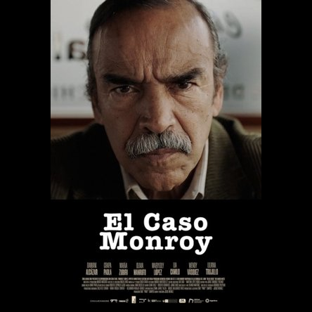

## 2025-11-14 – CLIP Poster Similarity Test

### 실험 구성
- 포스터: "El Caso Monroy" (어두운 범죄/조사 톤, 중년 남성의 클로즈업 구도).
- 비교 대상 인코더: JinaClipEncoder, OpenCLIPEncoder, OpenAICLIPEncoder.
- 입력: 범죄/다큐 감성과 밝은/레트로/청춘 시나리오를 모두 포함한 한·영 프롬프트.
- 전처리: 정사각형 패딩을 적용해 원본 구도를 최대한 유지.

### 핵심 관찰

보고자 하는 건 가장 비슷해야 하는 문장 "중년 또는 노년 남성의 진지한 얼굴 클로즈업" 이 가장 큰 값을 가지는지와,
가장 안비슷해야 하는 문장 "여자가 웃고 있는 얼굴"이 가장 낮은 값을 가지는지.

이 기준에서는 "영어"로 입력했을 때 -> Jina가 가장 좋아보임.

### Detailed Similarity Table
| Text                                                    | JinaClipEncoder | OpenCLIPEncoder | OpenAICLIPEncoder |
|---------------------------------------------------------|:---------------:|:---------------:|:-----------------:|
| 경쾌한 청춘 코미디·드라마 느낌                           |     0.1033      |     0.1663      |      0.1928       |
| A lively youth comedy/drama vibe                        |     0.0181      |     0.1637      |      0.2341       |
| 여러 명의 젊은 남녀가 함께 서 있는 그룹 샷              |     0.0879      |     0.1800      |      0.1869       |
| A group shot of several young men and women standing... |    -0.0199      |     0.0604      |      0.1448       |
| 남녀가 함께 있는                                        |     0.0985      |     0.1954      |      0.1935       |
| A man and a woman together                              |     0.0112      |     0.1159      |      0.1971       |
| 여름 분위기, 해변 또는 축제 느낌                        |     0.0979      |     0.1554      |      0.1141       |
| A summer vibe, beach or festival feeling                |    -0.0760      |     0.0830      |      0.1498       |
| 밝은 노란색/주황색 톤의 레트로 무드                     |     0.1054      |     0.1652      |      0.1540       |
| A retro mood with bright yellow/orange tones            |     0.0063      |     0.1465      |      0.1784       |
| 70s or retro fashion 스타일                             |     0.0200      |     0.1157      |      0.1581       |
| 70s or retro fashion style                              |     0.0042      |     0.1175      |      0.1557       |
| 음악/밴드 분위기 (기타, 악기 등 있음)                  |     0.1084      |     0.1891      |      0.1926       |
| Music/band atmosphere (with guitars or instruments)     |    -0.0187      |     0.1087      |      0.1717       |
| A cheerful and upbeat coming-of-age movie poster ...    |     0.0265      |     0.1265      |      0.1683       |
| 안녕                                                    |     0.0909      |     0.1782      |      0.1919       |
| Hello                                                   |     0.0297      |     0.1782      |      0.1925       |
| 중년 또는 노년 남성의 진지한 얼굴 클로즈업              |     0.0847      |     0.1620      |      0.1914       |
| Close-up of a serious-looking middle-aged or ...        |     0.1185      |     0.1460      |      0.2204       |
| 강렬한 눈빛, 무거운 표정                                |     0.1005      |     0.1826      |      0.1935       |
| Intense gaze, heavy expression                          |     0.0546      |     0.1694      |      0.2155       |
| 어두운, 사실적인 톤 (crime / investigation 스타일)      |     0.1047      |     0.1223      |      0.1866       |
| Dark, realistic tone (crime/investigation style)        |     0.0905      |     0.1242      |      0.2257       |
| 다큐멘터리 혹은 실화 기반 느낌                          |     0.0849      |     0.1621      |      0.1890       |
| Documentary or based-on-true-story feeling              |     0.1348      |     0.2412      |      0.2395       |
| 포스터 하단에 사건명 같은 타이틀 구성                   |     0.0736      |     0.1896      |      0.1789       |
| Poster layout with the case name as a title at ...      |     0.2004      |     0.2117      |      0.2678       |
| 여자가 웃고 있는 얼굴                                   |     0.0804      |     0.1788      |      0.1788       |
| A smiling woman's face                                  |    -0.0172      |     0.0791      |      0.1693       |
